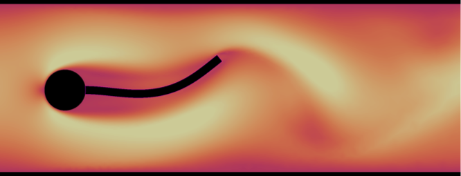

# Summary

It is often sufficient to study fluids [@Moin:1998] and solids [@Holzapfel:2002] in isolation to gain fundamental insights into a physical problem, as other factors may play a secondary role and can be neglected.  On the other hand, there are certain phenomena or situations where the stresses on or by a fluid or a solid can lead to large deformations, and the interaction between fluids and solids are essential [@LeTallec:2001]. Computational fluid structure interaction (FSI) is an active field of research with much focus on numerical accuracy, stability,  and convergence rates. At the same time, there is also a sweet spot in between these areas of research where there is a need to experiment with FSI without having an in-depth bottom-up mathematical understanding of the problem, but where a physical insight might suffice. The aim was therefore to develop a fully monolithic and robust entry-level research code (for users proficient in scientific computing) for exploration of FSI problems and benchmark purposes.

FEniCS [@Logg:2012] has emerged as one of the leading platforms for development of scientific software due to the close connection between mathematical notation and compact computer implementation, where highly efficient C++ code is compiled during execution of a program. Combined with the out-of-the-box entry-level high-performance computing capabilities, FEniCS was a natural choice of computing environment. The turtleFSI solver rely on a fully monolithic approach in the classical arbitrary Lagrangian-Eulerian formulation, and we used the generalized theta scheme for temporal discretization and P2P1P2 elements for velocity, pressure, and displacement, respectively. We implemented and evaluated four different mesh lifting operators, ranging from simple and efficient 2nd order Laplace equation, most suitable for small deformations, to more sophisticated and computationally expensive 4th order bi-harmonic equation that can handle larger mesh deformations. We used The Method of Manufactured Solutions to verify the implementation. The obtained results are formally second order accurate (L2) in space and time [@Wick:2011], respectively, and we demonstrate that all building blocks of code exhibit desired properties. The validity of the solver was confirmed using the classical Turek Flag benchmark case with good agreement – including a diverged numerical solution for long term evolution under certain conditions, as expected. For a complete justification of computational approaches and further details, we refer to [@Slyngstad:2017; @Gjertsen:2017]. We demonstrate adequate strong scaling up to 64 cores (from one cluster node), although the later is problem size dependent. In the online documentation we provide benchmarks, tutorials, and simple demos. The naive FEniCS implementation provides full transparency with compact code, which can easily be adapted to other 2D or 3D FSI problems. In conclusion, the turtleFSI solver is robust and performs exactly as designed and intended; ‘slow and steady wins the race’.

# Installation and Use

turtleFSI can be installed as a module on any operating system running FEniCS 2018.1.0 or above. First download the github repository and proceed to the installation as follow:
```console
  git clone https://github.com/KVSlab/turtleFSI.git
  cd turtleFSI
  python3 setup.py install
```

Note that you might need to run "python" or "python3" depending on your FEniCS version.
Linux or MacOs users can install turtleFSI within a conda environment with the simple command:
```console
  conda create -n your_environment -c conda-forge turtleFSI
```
Once turtleFSI is installed on your machine and the conda environment activated, you can run the turtleFSI demo simulation with all the default parameters by simply typing:
```console
  turtleFSI
```
To see all the command line parameters available:
```console
  turtleFSI -h
```
To run a specific problem file:
```console
  turtleFSI --problem [path_to_problem]
```

# turtleFSI in Action

turtleFSI comes with several problem files, found under /turtleFSI/problems/, to illustrate the usage and document the Turek flag benchmarks used to validate the implementation of the solver. Here are some illustration of the execution and outputs expected from the solver.

\
**Figure 1:**
  Fluid dynamics benchmark snapshot. Simulation executed with the command:
  ```
  turtleFSI --problem TF_cfd
  ```

\
**Figure 2:**
  Solid mechanics benchmark snapshots. Simulation executed with the command:
  ```
  turtleFSI --problem TF_csm
  ```

\
**Figure 3:**
  Full fluid-structure interaction benchmark snapshot. Simulation executed with the command:
  ```
  turtleFSI --problem TF_fsi
  ```

# Acknowledgements
The study was supported by The Research Council of Norway through the Center for Biomedical Computing (grant 179578), the Centre for Cardiological Innovation (grant number 203489), and the SIMMIS project (grant number 262827). Simulations were performed on the Abel Cluster (University of Oslo and the Norwegian metacenter for High Performance Computing (NOTUR), project nn9316k), and the Experimental Infrastructure for Exploration of Exascale Computing (eX3) cluster (Norwegian Research Council grant 270053).

# References
